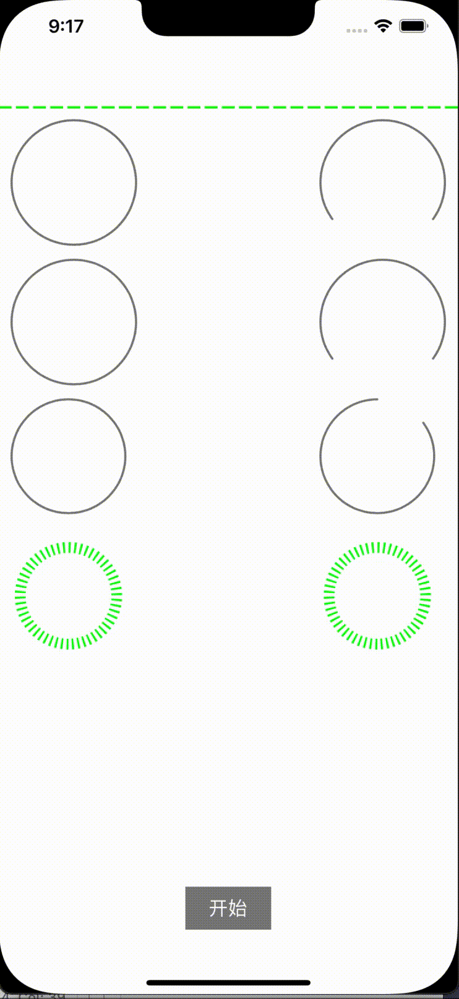

# HJProgress
一个多种进度条的封装
[](https://travis-ci.org/Mr.Heng/HJProgress)
[](https://cocoapods.org/pods/HJProgress)
[](https://cocoapods.org/pods/HJProgress)
[](https://cocoapods.org/pods/HJProgress)

## 图片展示


CSDN  
https://blog.csdn.net/u014651417/article/details/124461398

简书
https://www.jianshu.com/p/cc3cac5ce967

## CocoaPods
```
pod 'HJProgress'
```

## Example

To run the example project, clone the repo, and run `pod install` from the Example directory first.

## Requirements

## Installation

HJProgress is available through [CocoaPods](https://cocoapods.org). To install
it, simply add the following line to your Podfile:

```ruby
pod 'HJProgress'
```

## Author

Mr.Heng, 1219876794@qq.com

## License

HJProgress is available under the MIT license. See the LICENSE file for more info.
